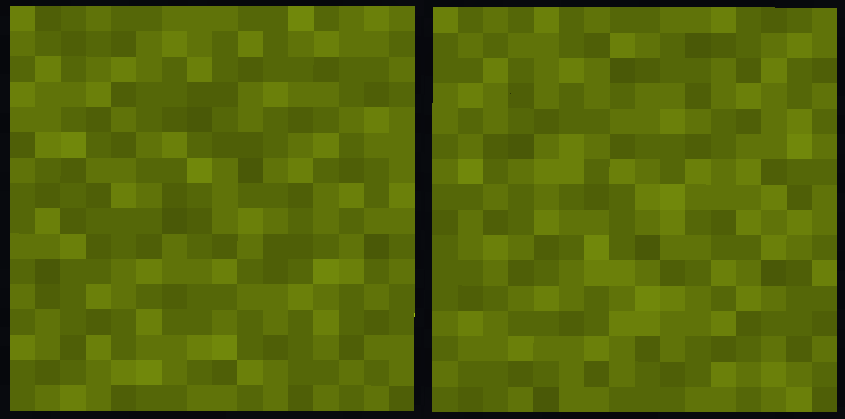

# NoTextureRotations

  

  
  

  
  
  
  
  
  
  
  

A Fabric mod to prevent coordinate exploits based on texture rotation and position offsets. Or if you prefer how it looks!

Compatible with Vanilla MC, Sodium, and custom texture/resource packs

# How the mod works

This mod can either:
1. Disable block texture rotations and offsets
2. Replace the random function with a secure implementation, which will retain the normal visual feel of the game

## Configuration

There are two ways to configure the mod in-game:
1. Install [YetAnotherConfigLib](https://modrinth.com/mod/yacl) and [ModMenu](https://modrinth.com/mod/modmenu)
2. Install [Sodium](https://modrinth.com/mod/sodium). A page for NoTextureRotation settings will be added to the Video Settings.

The configuration file is located at: `.minecraft/config/no-texture-rotations.json`

## What's the exploit?

Many blocks like grass, dirt, and stone have *variations* that rotate or change their textures slightly.

Texture variants are not inherently bad, they make the game visually more interesting as they prevent blocks from looking "same-y" when many are next to each other.

  

The problem is that the "random" number used to select the variant is seeded by the block's position in-game. No world seed is required.

Offsets works similarly, some blocks like flowers offset their position from the center of the block with a "random" offset.

Any screenshots or videos that show examples of these blocks are susceptible to an attacker cracking the block coordinates.

On anarchy servers, this can be particularly powerful - leading to bases with images or videos shared being found.

This is not a new discovery, and the method has been known since at least before 2018 and is still regularly used today
in reversing panorma seeds. Example: https://youtu.be/gE1dMNCyofs?t=57

There are multiple public tools to perform this:
* https://github.com/19MisterX98/TextureRotations
* https://github.com/coolmann24/TextureFinderJava

